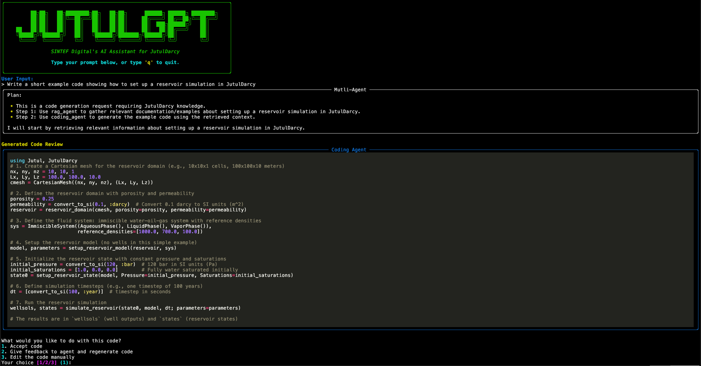

# JutulGPT

An AI assistant for JutulDarcy!



## Getting started

### Prerequisites

This project requires both **Python** and **Julia**, along with some system-level dependencies. Make sure these are installed:
- `git`: See [git downloads](https://git-scm.com/downloads).
- `Python3 >=3.12`: See NOTE or [Download Python](https://www.python.org/downloads/)
- `Julia`: Package tested on version 1.11.6. See [Installing Julia](https://julialang.org/install/).
- `build-essential`
- `graphviz` and `graphviz-dev`: See [Graphviz download](https://graphviz.org/download/)

Optional:
- `uv`: Recommended package manager. See [Installing uv](https://docs.astral.sh/uv/getting-started/installation/).
- `ollama`: For running local models. See [Download Ollama](https://ollama.com/download).

> NOTE: See [Installing python](https://docs.astral.sh/uv/guides/install-python/) for installing Python using `uv`. 


### Step 1: Python
Retireve the code by cloning the repository
```bash
# Clone and choose the repo
git clone https://github.com/ellingsvee/JutulGPT.git
cd JutulGPT/
```
If you are using `uv`, initialize the environment by
```bash
# Initialize the enviroment
uv venv
source .venv/bin/activate

# Install packages
uv sync
```


Alternatively, if you use `pip`, create and activate the virtual environment by
```bash
python3 -m venv .venv
source .venv/bin/activate
pip install -e .  # or `pip install -e .[dev]` for development
```
### Step 2: Julia
For running Julia code we also need to set up a working Julia project. 
```bash
julia
# In Julia
julia> import Pkg; Pkg.instantiate()
```
This will install all the necessary packages listed in the `Project.toml` the first time you invoke the agent.


### Step 3: Setup environment
You then have to set the environment variables. Generate a `.env` file by
```bash
cp .env.example .env
```
and modify it by providing your own `OPENAI_API_KEY` key.  For running in the UI you also must provide an `LANGSMITH_API_KEY` key.


### Step 4: Test it!

Finally, try to initialize the agent by
```bash
uv run examples/cli_multi_agent.py
```
This should install the necessary Julia packages before running. You might need to re-run the model after the installation.

## CLI 

Enable the CLI-mode by in `src/jutulgpt/configuration.py` setting
```python
cli_mode = True
```

Test it in the examples by running. 
```bash
# Run the Mutli Agent in CLI mode. I suggest the Multi Agent for most advanced tasks!
uv run examples/cli_multi_agent.py
```
This gives you a nice interface for asking questions, retrieving info, generating and running code etc. Both agents can also read and write to files.

## Settings and configuration
The agent is configured in the `src/jutulgpt/configuration.py` file.  

The two main settings you must specify are
```bash
# True if run from CLI and False if you use the UI
cli_mode: bool = True

# Select whether to use local models through Ollama or use OpenAI
LOCAL_MODELS = False
LLM_MODEL_NAME = "ollama/qwen3:14b" if LOCAL_MODELS else "openai/gpt-4.1-mini"
EMBEDDING_MODEL_NAME = (
    "ollama/nomic-embed-text" if LOCAL_MODELS else "openai/text-embedding-3-small"
)
```

More advanced settings are set in the `BaseConfiguration`. LangGraph will turn these into a `RunnableConfig`, which enables easier configuration at runtime.  You specify the following settings:
- `use_local_model`: Set to `True` for using local models through Ollama. By default equal to the `LOCAL_MODELS` variable.
- `retrieve_fimbul`: Whether to retrieve Fimbul documentation or not. If `False`, it will only retrieve JutulDarcy documentation.
- `max_iterations`: If the generated code fails. How many times the model will try to fix the code.
- `human_interaction`: Enable human-in-the-loop. See the `HumanInteraction` class in the configuration file for detailed control.
- `embedding_model`: Name of the embedding model to use. By default equal to the `EMBEDDING_MODEL_NAME`.
- `retriever_provider`: The vector store provider to use for retrieval.
- `documents_search_type`: Defines the type of search that the retriever should perform when retrieving documents.
- `documents_search_kwargs`: Keyword arguments to pass to the search function of the retriever when retrieving documents. See [LangGraph documentation](https://python.langchain.com/api_reference/chroma/vectorstores/langchain_chroma.vectorstores.Chroma.html#langchain_chroma.vectorstores.Chroma.as_retriever) for details about what arguments works for the different search types.
- `examples_search_type`: Defines the type of search that the retriever should perform when retrieving examples.
- `examples_search_kwargs`: Keyword arguments to pass to the search function of the retriever when retrieving examples. See [LangGraph documentation](https://python.langchain.com/api_reference/chroma/vectorstores/langchain_chroma.vectorstores.Chroma.html#langchain_chroma.vectorstores.Chroma.as_retriever) for details about what arguments works for the different search types.
- `rerank_provider`: The provider user for reranking the retrieved documents.
- `rerank_kwargs`: Keyword arguments provided to the reranker.
- `response_model`: The language model used for generating responses. Should be in the form: provider/model-name. Currently I have only tested using `OpenAI` or `Ollama` models, but should be easy to extend to other providers. By default equal to the `LLM_MODEL_NAME`.
- `supervisor_model`: See `response_model`.
- `rag_model`: See `response_model`.
- `coding_model`: See `response_model`.
- `default_coder_prompt`: The default prompt used for generating Julia code.
- `supervisor_prompt`: The prompt used for the supervisor agent.
- `rag_prompt`: The prompt used for the RAG agent.
- `code_prompt`: The prompt used for the coding agent.

The settings can be specified by passing a configuration dictionary when invoking the models. See f.ex the `run()` function in `src/jutulgpt/multi_agent_system/multi_agent.py`. Alternatively, the UI provides a custom interface where the settings can be selected.

## UI
The JutulGPT also has an associated UI called [JutulGPT-UI](https://github.com/ellingsvee/JutulGPT-UI).  For using the UI, you must disable the CLI-mode. To this by setting `cli_mode = False` in `src/jutulgpt/configuration.py`.

Install it by following the instructions in the repository. Alternatively do
```bash
cd .. # Move to parent directory
git clone https://github.com/ellingsvee/JutulGPT-UI.git # Clone JutulGPT-UI
cd JutulGPT-UI/
pnpm install
cd ../JutulGPT/ # Move back to JutulGPT
```

To run the UI locally, you have to use the [LangGraph CLI](https://langchain-ai.github.io/langgraph/cloud/reference/cli/) tool. Start it by
```bash
langgraph dev # Run from JutulGPT/ directory
```
and start the UI from the JutulGPT-UI directory by running
```bash
pnpm dev # Run from JutulGPT-UI/ directory
```
The UI can now be accessed on `http://localhost:3000/` (or some other location depending on your JutulGPT-UI configuration).

For enabling generative UI components do 
```bash
cd src/ui
pnpm install
cd ../..
```

Note, if you plan on using the UI, you must also set `cli_mode = False` in `src/jutulgpt/configuration.py`.

## Fimbul (NOTE: Not well tested)
For using the model to generate code for [Fimbul](https://github.com/sintefmath/Fimbul.jl), install the package by cloning the repository
```bash
cd .. # Move to parent directory
git clone https://github.com/sintefmath/Fimbul.jl.git # Clone Fimbul
cd JutulGPT/ # Move back into JutulGPT
```
```julia
using Pkg; Pkg.activate(".");
Pkg.develop(path="../Fimbul.jl/");
Pkg.instantiate()
```
For the RAG to retrieve from the Fimbul documentation, set the `retrieve_fimbul = True` in `src/jutulgpt/configuration.py`.

## Testing (NOTE: Tests must be updated!)
Tests are implemented using [pytest](https://docs.pytest.org/en/stable/). Run tests by
```bash
uv run pytest
```

## Known issues
- Need to double check the Fimbul installation.
- Using GLMakie can cause issues when running the code.

## Potential improvements
- Update UI using a callback when running the Julia code. As of now there is no clear indication that the program is running.
- Update the configuration settings during runtime from the CLI.
- Consider `JuliaCall` for better calling of Julia code from Python.
